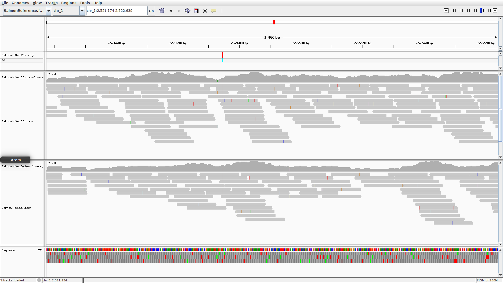

## Bioinformatics for evolutionary biologists

*We have tried to keep jargon to a minimum, but if there are things that you want us to clarify or terms you want us to define please don't be afraid to ask!*

In this workshop, we aim to cover the basics of bioinformatics. This course is aimed at those who have some familiarity with computational tools.

## Accompanying material
[Lecture Slides](https://drive.google.com/file/d/1Hq2b1vuB7GMvlHR1khhGByeUacvrhKEM/view?usp=share_link)

[Download link for the tutorial data](https://drive.google.com/drive/folders/17wNzwy8BWywonhpggyiM17UTagVx8X12?usp=sharing)

____________________

# Part 1

## The Integrative Genomics Viewer

In this first tutorial, we are going to use the Integrative Genomics Viewer (IGV) to manually inspect several types of files that you may come across in bioinformatics.

While it may seem topsy-turvy to start the workshop by looking at results before generating results, exploring data in IGV is a really great way to understand the types of data that you will likely encounter in bioinformatics in evolutionary biology.

IGV was developed and is maintained by the Broad Institute (who also maintain many other widely used packages). The IGV provides users with a graphical user interface (GUI) for inspecting and curating datasets. It's a remarkably flexible tool that is invaluable in many instances. Here's how the Broad describes it:

*The Integrative Genomics Viewer (IGV) is a high-performance, easy-to-use, interactive tool for the visual exploration of genomic data. It supports flexible integration of all the common types of genomic data and metadata, investigator-generated or publicly available, loaded from local or cloud sources.*

The first thing that you need to do in this tutorial is to get IGV up and running on your machine.

IGV is written in Java and is available as a pre-compiled package from the Broad Institute. IGV can be freely downloaded at: [https://software.broadinstitute.org/software/igv/](https://software.broadinstitute.org/software/igv/). IGV is written in Java, so if you do not have Java installed on your machine, use the *Java Included* versions of the program for your specific machine.

The download page should look like this:

{: width="100%"}

The links highlighted by the blue blob are what you are after.

## Download data for the tutorial

**Figure out a good way to make the data downloadable - where to host the data so that there is a reproducible ?**

The second thing to do is to download the data package for Tutorial 1 available at the following link:

Once the data has finished downloading, move the data to a memorable location.  

If everything went Ok, you should have the following files:

```shell

SalmonReference.fasta ## This is a text file containing the reference genome

SalmonAnnotations_forIGV.gff ## A file containing the locations of genomic elements (in this case genes)

Salmon.HiSeq.5x.bam ## A file containing the alignments of paired-end
                     ## Illumina HiSeq reads to the reference genome - at 10x

Salmon.HiSeq.10x.bam ## A file containing the alignments of paired-end
                      ## Illumina HiSeq reads to the reference genome - at 10x

Salmon.HiSeq.20x.vcf.gz # A file containing variants called from the 10x Illumina data


Salmon.ddRAD.bam ## A file containing the alignments of double-digest RAD seq.
                 ## reads to the reference genome

Salmon.16x.PacBio.bam ## A file containing the alignments of PacBio  reads to the Salmon reference


coldWaterSalmon.RNA.bam ## A file containing RNA-seq data aligned to the reference genome

SalmonData_checksums.sha ## See below

## Each of the files ending in ".bam" and the ".vcf" file also have index files associated (those ending in ".bai" and ".tbi")

```

There are a number of file types here, by the end of the week you'll have seen how each of these kinds of files are generated, understand what information they contain and have an idea of what you can do with them.


____________
# Part 2: The reference genome

## Load the reference genome into IGV
*Do not proceed unless you have set up IGV on your machine*
_
Open up IGV on your machine, you should be seeing something like the following (don't worry if it looks a little different):
{: width="100%"}

You may notice "hg19" in the drop down menu on the top left (highlighted in orange). "hg19" stands for human genome version 19, it's fun to explore the human genome, but today we're going to explore the genome of the system we're working with in this workshop .

The first thing to do is to load in our reference genome. From the drop-down menu in the top left, choose the ```Genomes``` menu and choose ```Load Genome From File...```. When the box opens up, navigate to the data you downloaded and choose the ```ReferenceGenome.fasta.gz``` file. The file extension ".fasta.gz" tells us that this is a FASTA file (a simple text file that represents a genetic sequence - DNA, RNA or peptides).


IGV is pretty intuitive so you should be able to navigate your way around. Don't hesitate to let us know if you get stuck.

#### *Discussion points*:

* *How many chromosomes do our Salmon have?*
* *What is the length of each chromosome?*
* *What is the nucleotide sequence corresponding to chr_1:666-670*

____________
# Part 3 Inspect sequence alignments into IGV
## Part 3.1: Whole genome sequencing - 5x Illumina reads

Let's go ahead and load a file containing sequence alignments. To begin with, load up the file ```Salmon.HiSeq.5x.bam``` in IGV as follows:

1. Make sure "SalmonReference.fasta" is selected from the genome menu as above.
2. Using the dropdown menu labelled ```File```  (top-left of the IGV screen) choose ```Load From File``` and navigate to ```Salmon.HiSeq.5x.bam```.

This file (and the others like it) contains information on paired-end short reads generated using an Illumina HiSeq machine. The data has been aligned to the reference genome we are using and is stored as a "BAM" file. A "BAM" file is a file containing the alignment of genetic sequences to a reference genome in binary format. Don't try to open the BAM file to look at the contents as this end in confusion for you and your computer.

Files in binary format are often smaller than plain text, and going from binary to text involves work for your computer - so binary can be worked with more efficiently. BAM stands for **B**inary **A**lignment **M**ap. Don't worry, we'll go over the details of SAM/BAM formats later in the week, for now though, just know that they are a type of file containing genetic sequence alignments.

If the data loaded happily, choose a chromosome from the dropdown menu and zoom in to any location in the genome (by double clicking or using the zoom bar in the top right corner). The window should look a little like this:

<details>
  <summary>Click to expand! </summary>

{: width="100%"}

</details>


We are looking at a graphical representation of the short reads aligned to our reference genome. Illumina technology is amazing, but it is not perfect. Explore the alignment, using your mouse or trackpad, scroll through the alignment and get a feel for navigation in IGV.

#### *Discussion point*:

* *What do you think is meant by sequencing depth?*
* *What do you think is meant by sequencing breadth?*

What do you think would happen if we doubled the depth of sequencing? Why wonder? Let's do it...

### Whole genome sequencing - 10x Illumina reads

Now let's load the file named ```Salmon.HiSeq.10x.bam``` in IGV as before. These data were sequenced using the same method as above, but we doubled the sequencing depth this time.

Compare the ```5x``` and ```10x``` data. What does doubling the sequencing depth give you?

#### *Discussion point*:

* *What do you think the challenges are with using this data to make biological inferences?*
* *What features should be used to assess the quality of an alignment?*

## Part 3.2: Whole genome sequencing - PacBio long reads

For the next part, we'll need to remove the browser tracks we've opened. This is to make sure we don't use too much of your machine's memory. To remove a track in IGV, select it on the left hand side of the browser (where the file name appears) and hit ```Delete``` on your keyboard.

**Before reading in the next file, we'll want to tweak a couple of IGV options.**

1. Using the dropdown menu labelled ```View```  (top of the IGV screen) choose ```Preferences``` and navigate to the ```Third Gen``` tab.
2. Under ```Hide indels < show indel threshold``` replace 1 with 3.
3. Check the box that says ```Quick consensus mode```

{: width="100%"}

Once you've removed the previous two tracks and tweaked the options, load up the file ```Salmon.16x.PacBio.bam``` in IGV as above.

This file contains information on long reads generated using Pacific Bioscience's HiFi technology. The data have been aligned to the reference genome we are using and is stored as a "BAM" file as before.


#### *Discussion points*:

* *What differences have you noticed between the Illumina data and the PacBio data?*
* *What do you think this data would be useful for?*

## Part 3.3: Reduced representation sequencing - ddRAD-seq


As before, we'll load up a BAM file into IGV. The file ```Salmon.ddRAD.bam``` contains alignments of the ddRAD sequencing data aligned to the reference genome. Explore this data in IGV and contrast it with the whole genome sequencing from before.

By now you should be familiar with how to lead alignments into IGV.

*Note, the individual sequenced using ddRAD is not the same as the one we sequenced using Illumina or PacBio.*

#### *Discussion points*:

This kind of sequencing has many advantages (it is relatively cheap, you don't need a reference genome, the bioinformatics are fairly straightforward )
* *What are some analyses that you could do with such data?*


## Part 3.4: RNA-seq

Now we'll load up some RNA-seq data into IGV. Up to now, we've been sequencing data without really paying much attention to what it is the genome that we are sequencing. Now we are working with RNA, though, so it would be useful to compare the data back to the locations of actual genes in the Salmon genome.

Let's start by loading up the alignment of RNA-seq data. As before, remove old tracks and load up the RNA seq file ```coldWaterSalmon.RNA.bam```. This is RNA extracted and sequenced from a Salmon from a cold location - we will return to that later in the week.

Now load in Salmon genes. You can do this like you have been doing for all the alignments (by choosing ```SalmonAnnotations_forIGV.gff``` after clicking ```File``` then ```Load From File```).

Now you should see diagrams indicating genes in the Salmon genome on a track at the bottom of the screen. Something like this:

{: width="100%"}

Explore this data, and get a feel for some of the differences between the results of genome sequencing and RNA-seq

We'll discuss the structure of the ```SalmonAnnotations_forIGV.gff``` file with the class.

#### *Discussion points*:

* *How could you assess gene expression using RNA-seq data?*
* *Can you think of any challenges of aligning RNA-seq data to a refernece genome?*


## Part 4: Variants

Now the fun really starts.

One of the common tasks in bioinformatics is to identify genetic variation. Identifying genetic variation may seem straightforward, but there are many complicating factors.  

First, let's reload the Illumina whole genome data that we were analysing previously (```Salmon.HiSeq.5x.bam``` and ```Salmon.HiSeq.10x.bam``` ). In addition, also load up the file named ```Salmon.HiSeq.20x.vcf.gz```. This will load up an additional track that shows the locations of genetic variants that were identified before the tutorial.

If you've successfully loaded in all the data, you should have a window that looks like this:

{: width="100%"}

In this window the variants are loaded in and shown in the top bar of the plot. IGV colour codes many things (as you'll have noticed). Note that homozygous variants are coloured in a light turquoise blue, heterozygous variants are in dark blue.

The standard format for genetic variant information is the Variant Call Format (VCF). Later in the week you'll be using a program called GATK to generate VCF files and we'll walk through the anatomy of the files.


#### *Discussion points*:

* *When you compare the locations of variants called with high confidence with the sequence alignments, what do you notice?*
* *What features of an alignment do you think should be assessed when calling variants?*
____________________

Hopefully by now you'll have an appreciation for how different technologies and methods give you different insights. When designing a research project involving bioinformatics, it is prudent to think of how best to match technologies and research questions when balanced against finite budgets.

## I hope you had fun!
