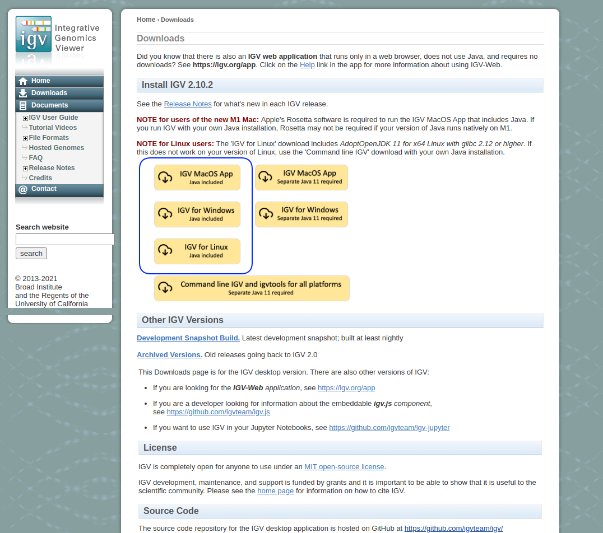

# Introduction to BIOL525D

## Bioinformatics for evolutionary biologists

*We have tried to keep jargon to a minimum, but if there are things that you want us to clarify or terms you want us to define please don't be afraid to ask!*

In this workshop, we aim to cover the basics of bioinformatics. This course is aimed at those who have some familiarity with computational tools.

There are a number of tools for applying bioinformatic tools with a graphical user interface (such as [Galaxy](https://usegalaxy.org/) and [Geneious](https://www.geneious.com/)). These programs are great and certainly have their place. However, I (Tom) would argue that learning how to use the command line is preferable as it provides far more flexibility and reproducibility and is also a highly transferable skill.

There is a very steep learning curve when it comes to the command line.  The purpose of this workshop is not to teach you how to use the command line *per se*, it takes a lot of practice and learning to get comfortable using the command line. The purpose of this workshop is to demonstrate the fundamentals of bioinformatic analysis. We will need to use the command line throughout the week. It would be best if participants had taken part in an introduction to the Unix command line before participating in this workshop, if you not had the time to do that, that's Ok, but there may be places where some things seem a bit opaque. Please do not hesitate to ask questions and do not be put off if you find certain things opaque to begin with.

Additionally, we have tried to focus on concepts rather than particular software packages. This field is moving so fast that most programs and packages are out of date before too long. That being said, we have had to choose some packages to use for the tutorial, but these should not be seen as the be-all and end-all. There are many packages for specific purposes that we do not have time to go over.

______

## The Integrative Genomics Viewer

In this first tutorial, we are going to use the Integrative Genomics Viewer (IGV) to manually inspect several types of files that you may come across in bioinformatics.

While it may seem topsy-turvy to start the workshop by looking at results before generating results, it is good to understand the 

IGV was developed and is maintained by the Broad Institute (who also maintain many other widely used packages). The IGV provides users with a graphical user interface (GUI) for inspecting and curating datasets. It's a remarkably flexible tool that is invaluable in many instances. Here's how the Broad describes it:

*The Integrative Genomics Viewer (IGV) is a high-performance, easy-to-use, interactive tool for the visual exploration of genomic data. It supports flexible integration of all the common types of genomic data and metadata, investigator-generated or publicly available, loaded from local or cloud sources.*

The first thing that you need to do in this tutorial is to get IGV up and running on your machine.

IGV is written in Java and is available as a pre-compiled package from the Broad Institute. IGV can be freely downloaded at: [https://software.broadinstitute.org/software/igv/](https://software.broadinstitute.org/software/igv/). IGV is written in Java, so if you do not have Java installed on your machine, use the *Java Included* versions of the program for your specific machine.

The download page should look like this:


The links highlighted by the blue blob are what you are after.

## Download data for the tutorial

The second thing to do is to download the data package for Tutorial 1 available at the following link:


Once the data has finished downloading, open up the downloaded data, you should have the following files:

```{r}

ReferenceGenome.fasta.gz ## This is a text file containing the reference genome

SalmonAnnotations.gtf.gz ## A file containing the locations of genomic elements (in this case genes)
SalmonAnnotations.gtf.gz.tbi ## An index for the above file  

Salmon.MiSeq.30x.bam ## A file containing the alignments of paired-end
                     ## Illumina MiSeq reads to the reference genome - at 30x

Salmon.MiSeq.10x.bam ## A file containing the alignments of paired-end
                     ## Illumina MiSeq reads to the reference genome - at 10x

Salmon.ddRAD.bam ## A file containing the alignments of double-digest RAD seq.
                 ## reads to the reference genome

Salmon.Nova.bam ## A file containing the alignments of PacBio NovaSeq reads to
                 ## reads to the reference genome

## Each of the files ending in ".bam" also have an index file (those ending in ".bai")


```
