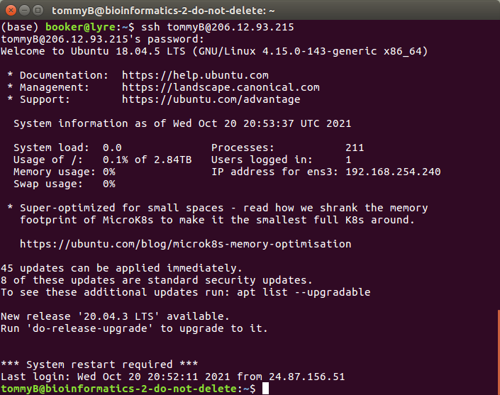
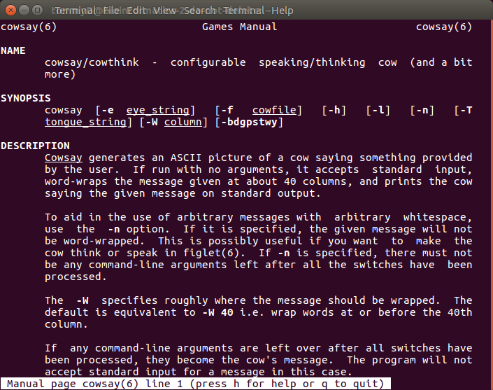
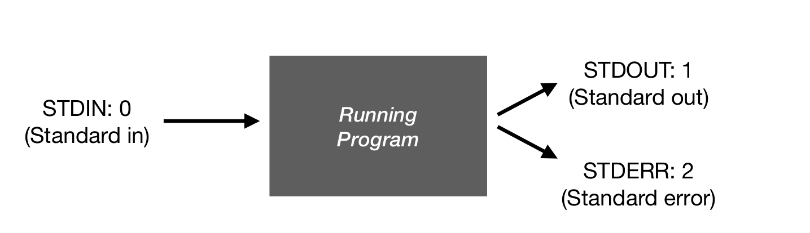
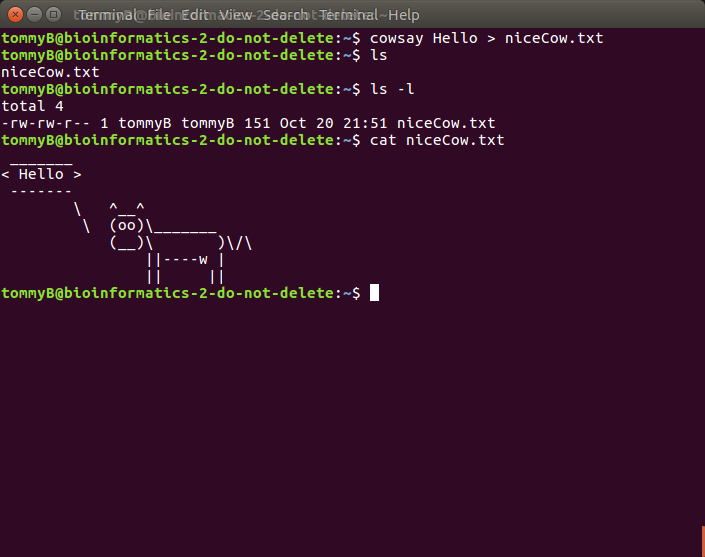
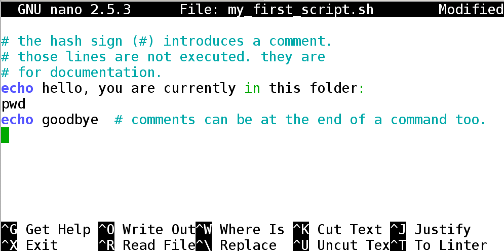
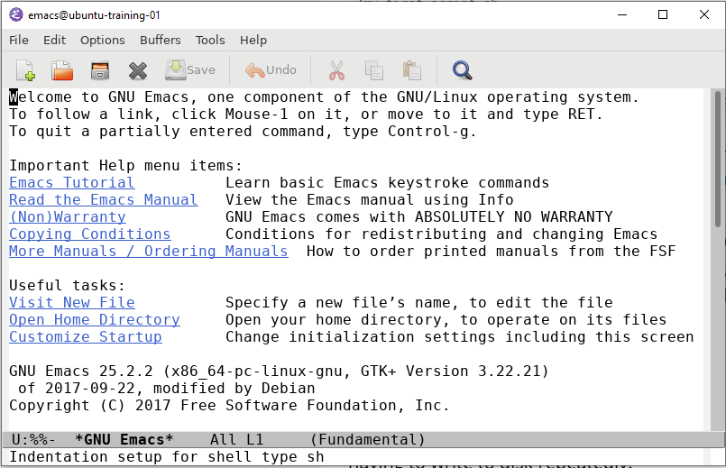

There are a number of tools for applying bioinformatic tools with a graphical user interface (such as [Galaxy](https://usegalaxy.org/) and [Geneious](https://www.geneious.com/)). These programs are great and certainly have their place. However, I (Tom) would argue that learning how to use the command line is preferable as it provides far more flexibility and reproducibility and is also a highly transferable skill.

There is a very steep learning curve when it comes to the command line.  The purpose of this workshop is not really to help you become a command line expert, so don't worry if you are finding it difficult. It takes a lot of practice and learning to get comfortable using the command line.

The purpose of this workshop is to demonstrate the fundamentals of bioinformatic analysis. We will need to use the command line throughout the week, so it would be best if participants had taken part in an introduction to the Unix command line workshop before participating in this one, if you not had the time to do that, that's Ok, but there may be places where some things seem a bit opaque.

Please do not hesitate to ask questions and do not be put off if you find certain things difficult to begin with, but remember that the primary purpose of this workshop is to become familiar with bioinformatic tools and a general familiarity with UNIX command line environments is strongly encouraged.
______________

We have tried to focus on concepts rather than particular software packages in this workshop. This field is moving so fast that most programs and packages are out of date before too long. That being said, we have had to choose some packages to use for the tutorial, but these should not be seen as the be-all and end-all. There are many packages for specific purposes that we do not have time to go over.


### Accompanying material

* [Slides](./Topic_2.pdf)
* [Software Carpentry Tutorial](http://swcarpentry.github.io/shell-novice/)

# Part 0: Logging on to the servers:

We have set up virtual machines (VM) for the workshop. You should have received an email about the particular VM you'll be using. To access the VMs we'll use a command line program called "Secure Shell" (```ssh```).

The program ```ssh``` is a very widely used piece of software that is normally installed on most Linux distributions, Macs too. If you are working on Windows, on the other hand, it is a little more involved...

### Mac/Linux instructions

If you are working on a Mac or a machine running a Linux distribution, it is as simple as opening the Application called ```Terminal```.

### Windows Instructions

If you are working on a PC and running a Windows version later than 10, you should be able to use Windows Terminal or Windows PowerShell. If you're using an earler version of Windows you'll need to download, install and use something like Putty to access the virtual machines.

[Instructions for using Putty and MobaXTerm can be found here](../old_intro/old_topic1_readme.md)
____________
Once you have access to a comand line interface do the following to login to the server:

```
ssh my_user_name@123.456.789
  # my_user_name should be whatever your username is
  # 123.456.789 is the IP address of the server
```
When you hit enter, you'll be asked to enter your password. Note that when you do that you will not see any text appear as you write - this is a security feature of ```ssh```.

# Part 1: Interface:


## 1.1 Prompt or command line

You should see a blinking cursor and a screen that looks something like this:
{: width="100%"}

The white text is mostly a welcome screen that lets you know the status of the machine you've just logged in to. For the purposes of this tutorial ignore this text.

## 1.2 Output

### Cowsay

The first thing you should do is to enter the following command:

```bash
cowsay Hello
```

This should have printed a picture of a happy little cow to your screen. ```cowsay``` is a very helpful little program for whenever you need a little pick-me-up.

The cow picture is an ASCII image, which means that it is text characters arranged to make a picture. The ASCII cow is the ```STDOUT``` from the ```cowsay``` program.

## 1.3 Arguments

Command line programs offer their users lots of control that may not be as easily accessed when using a GUI. The ```cowsay``` program has lots of options for changing the appearance of our little bovine friend.

Most command line tools come with a manual that can be accesed rather easily. There is a program called ```man``` (short for manual) which can be used to look through all the diferent options for a program.

You use ```man``` by calling that program and specifying which manual you would like to look at. For example:

```bash
man cowsay # this will bring up the manual for ```cowsay```
```

It should look like this:

{: width="100%"}

This is an explorable text document that you can scroll through using the arrow keys.

The manual tells us that there are lots of ways to customise the cow.

Try a few out, for example:

```bash
cowsay -W2 -t 420
```

Obviously ```cowsay``` is great, but there are tons of more useful programs that you should try and familiarise yourself with. Here are some examples based on my own usage:

```bash
ls  # list the files in a directory
cd  # change directory
wc  # counts the number of lines, words and characters in a file
top # prints an active summary of what your machine is doing right now (exit by hitting "q")
cp # copies a files
ps # lists active processes that you have launched
cat # concatenate a file to STDOUT
mkdir # make a new directory (or folder)
head # list the first few entries of a files
mv # Move a file from one place to another (or rename a file)
less # scroll through a file
more  # scroll through a file - similar to less, but less good
which # tells you where a file is located
pwd # prints working directory to STDOUT - handy for checkoing where you are
rm # delete a file
grep # highly efficient program for finding  text strings in files
awk # a highly efficient language for reading/editing files
sed # a highly efficient program for performing complicated find and replace operations
chmod # used to change permissions on a file
ssh # secure shell - a program and protocol for accessing remote computers
seq # send a sequence of numbers to STDOUT
echo # concatenate a given text string to screen
who # tells you who you is logged in to a server
kill # terminate a running process
passwd # change passwords
```

Some of these are really simple, but are crucially important for being able to navigate the command line happily. Others are more complex (such as ```awk``` and ```sed```) and take lots of time to learn and master. This list is by no means exhaustative, and should be used as a jumping off point.


### Getting help

most programs come with a manual page, explaining all options. You can get help about individual command with the following:

1. for command structure, variables, and shell rules: `man bash`
1. bash builtins: `help`, and `help <cmd>`. help on for loops: `help for`, help on conditionals `help if`, help on change directory `help cd`, etc.
1. for help on external programs, like `ls`, `grep`, `sed`, `awk` you have to look at their manual pages: e.g. `man sed`
1. for viewing the contents of a file on screen, use `less`

Programs like `man` and `less` show an on-screen navigation system:
 - arrows and <kbd>pgup</kbd>/<kbd>pgdn</kbd> will let you scroll around.
 - <kbd>&lt;</kbd> and <kbd>&gt;</kbd> seek to the start and the end.
 - You can search with <kbd>/</kbd>: e.g.  <kbd>/</kbd> + `[dD]og` + <kbd>enter</kbd> will search for "dog" or "Dog". then <kbd>n</kbd> and <kbd>p</kbd> to go the next and previous occurrence.
 - <kbd>Esc</kbd> can be used to abort a command. <kbd>CTRL</kbd>+<kbd>c</kbd> aborts loading a file.
 - <kbd>q</kbd> *q*uits.


## 2 Interface: STDIO

There are three data streams that programs have access to in UNIX like systems. Remember, everything is a file, so we can work with each element as we see fit.

{: width="100%"}

You can manage the flow and access each of the streams using certain commands.

### STDOUT
Many programs will write their output directly to a file that you have specified, but many will print the results directly to the screen. The results of a program that did not run with errors will typically be sent to STDOUT. As you may imagine, being able to save the output of a program or process is very important, so we need to be able to direct STDOUT to a file.

For example, when we ran ```cowsay Hello``` the text that made up the picture of the cow was sent to STDOUT.

Try running the following:

```
cowsay Hello > niceCow.txt
```
This time, nothing will have been printed to screen.

However, if we list the contents of our directory, we'll see that there is now a file called ```niceCow.txt``` that is stored in our home directory.

{: width="100%"}

I used the ```ls``` command to list the file that are in my working directory. I used ```ls``` twice. The second time I used the ```-l``` option, which prints the output as a table containing information about the files present such as their permissions, who owns the file, how big it is, when it was made and what it is called. You may have also noticed that I used the ```cat``` program to send the contents of the cow file to STDOUT and it was printed to screen.

Any program that sends its output to STDOUT can be captured using the ```>``` symbol. In Unix, we call that symbol a "redirection" symbol.

Let's run some other programs and capture the output

```
cowsay Hello > niceCow.txt
cowsay You stink > nastyCow.txt
cowsay e=mc2 > smartCow.txt
echo "Hello Joe" > Hello_Joe.txt
echo "Dental Plan" > Dental_Plan.txt
echo "Lisa Needs Braces" > Braces.txt
```

In each of the above cases, we saved STDOUT to a file. If it worked, you should have 6 files in your directory now, one for each of the redirects we just used.
____________________

### STDERR

STDERR is another stream that is often used to print program logs and error messages to screen. For example, let's run a program incorrectly and see what happens.

If we run:
```
seq 1 5

```
we should get a nice list of numbers printed to the screen.

Or if we run:
```
seq 1 5 > numbers.txt

```
We should now have a little file that contains the numbers 1 through 5.

The `seq` program prints a sequence of numbers to STDOUT. It comes in handy in various ways.

If we provide non-numeric input to `seq`, however, it will throw an error. For example:
```
seq a g
```
The program is not happy and throws and error

If we save STDOUT in such a case we'll end up with an empty file:
```
seq a g > letters.txt
cat letters.txt
```
But the error message still comes through. The error message that is printed to screen is actually being sent to STDERR.

We can capture STDERR if we want to:
```
seq a g 2> letters_log.txt
cat letters_log.txt
```

This time, we saved the error message in a file using `2>`. The `2>` tells UNIX to send stream #2 (a.k.a. STDERR) to a the file that we specified.

FYI, stream #1 is actually STDOUT. You could save STDOUT by writing `1>`, and there are times when you need to  be specific. However, Unix assumes STDOUT when redirecting by default, so when you're starting out you probably won't need to specify that.

___________________


### Pipes

One of the major advantages of working with the Unix command line is the control over the flow of STDIN/STDOUT. Taking the output of one program and feeding to another is very computationally efficent as it means that you don't have to write intermediate files, which wastes a whole bunch of time.

For the sake of demonstration, let's say that we wanted to get a count of how many files there were in our working directory. We could run `ls` then count how many things were printed to screen. With a small number of files that's not a big deal, but if you have tens or hundreds of files, that's becomes a big waste of time.

Using some simple UNIX commands we can count how many files we have generated so far and hopefully demonstrate how we can make use of the flow of STDIN/STDOUT.

We know that the following will print a list of our files in our wd to STDOUT:
```
ls
```

Another program, `wc` provides a count of the number of lines, words and characters there are in a file. If we use `wc -l` (note the `-l` argument), we will just count the number of lines. However, `wc` takes it's input from STDIN.

We could do the following:
```
ls > list_o_files.txt
wc -l list_o_files.txt
```
and this should tell us how many files we have. However, now we have an annoying intermediate file in our directory that we'll have to clean up.

It's easy to remove the intermediate file:
```
rm list_o_files.txt
```
But the point is that it takes time to remove the file and not only that, it takes time for the computer to write the intermediate file to disc and then it takes time for the next program to read the file. When you're working with massive datasets like you will later on in the week, generating a lot of intermediate files can really hammer productivity and take up precious disc space.

Let's take the above example and send the STDOUT of `ls` as input to `wc`:

```
ls | wc -l
```
We'll get the exact same answer, but we've skipped a step and saved ourselves the use of an unnecesarry intermediate file.

The `|` character we used is referred to as a "pipe" and is another form of redirection.

Even though this example is fairly trivial, piping is incredibly useful and can be used to great effect in bioinformatics, saving precious disc space and making analyses more efficient.

In the exercises below we'll get some more practice using pipes. There is no rule saying that you must use pipes when you're writing your scripts and running code, but it is good to be aware of how your choices will affect performance.
____________________


<a name="editing"></a>
### Editing

In your life as a bioinformatician, you'll spend a lot of time writing and editing scripts. Scripts are human readable text documents so you'll need software to write and edit your code.


*Do not use word processing software like Pages, Notepad or Word at all when you're working with scripts or code*. These programs do not typically generate plain  documents. Even opening files in those programs can cause you headaches, so they should be avoided at all costs! Instead, look up some script editing software. There are lots of options. My personal favourite is Atom ([https://atom.io/](https://atom.io/)), but there are others such as Sublime Text, Visual Studio Code (VS Code) or Gedit. Script editing software often has lots of handy features like syntax highlighting which make coding and scripting much easier.  Your computer will have shipped with a simple plain text editor (e.g. Wordpad or gedit), and these are totally fine for using during the workshop.

Additionally, it pays dividends to get to grips with a text editor that you can access at the command line. In this workshop we'll be going back and forth from the servers to your local machines. If you downloaded your scripts to your local machine, edited them then reuploaded them everytime you wanted to made slight changes you'd soon go mad. It would take a ton of your precious time and you'd likely incur errors going back and forth.

There are several editors that you can run directly on the server. Editing directly on the server is faster because you'll be debugging iteratively.

 - `nano filename`. a barebones editor with key bindings similar to notepad. good for small edits. **easiest option**
    - `nano -l filename` shows line numbers.
	- `nano -z filename` allows suspending the editing with <kbd>CTRL</kbd>+<kbd>z</kbd>
	- <kbd>CTRL</kbd>+<kbd>o</kbd> to save. <kbd>CTRL</kbd>+<kbd>c</kbd> to cancel, <kbd>CTRL</kbd>+<kbd>x</kbd> to exit.
 - `vim filename`
    - tutorial: https://computers.tutsplus.com/tutorials/vim-for-beginners--cms-21118
    - <kbd>:</kbd><kbd>q</kbd> quits.
	- `i` enters insert (edit) mode
	- <kbd>ESC</kbd> exits a mode.
	- <kbd>:</kbd><kbd>w</kbd> saves.
	- <kbd>:</kbd><kbd>!</kbd><kbd>q</kbd> rage quits.
 - `emacs filename`
    - tutorial: https://www.gnu.org/software/emacs/tour/
	- <kbd>CTRL</kbd>+<kbd>x</kbd> <kbd>CTRL</kbd>+<kbd>c</kbd> exits
	- <kbd>CTRL</kbd>+<kbd>g</kbd> cancels
    - <kbd>CTRL</kbd>+<kbd>x</kbd> <kbd>CTRL</kbd>+<kbd>s</kbd> saves

### Reference: Creating a script

 You will be asked to type commands interactively, but in later topics you will be asked to create scripts. Here is an example to create a bash script, which by convention ends with `.sh`.

# here we use nano, but you could use any other editor of choice
```
nano my_first_script.sh
```
If the file doesn't exist, you will see an empty file. You can then type content (i.e. a series of bash commands) in the file. Example:

{:width="70%"}

Save the file, and exit. You can then run this script with:

```
bash my_first_script.sh
```


If you add the special line `#!/bin/bash` (aka "hashbang") at the top of your script, and mark the script executable (`chmod +x my_first_script.sh`), then you will be able to run it more easily:

    ./my_first_script.sh

If you have X11 Forwarding enabled, you can use graphical editors installed on the server:

     # emacs supports both terminal based and window (x11) based
	 emacs my_first_script.sh

If you see a window come up, then your X forwarding is configured correctly. Otherwise the terminal version will come up. Graphical emacs looks like this (hit `q` to remove the welcome screen):

{:width="50%"}


### <a name="copying-files"></a> Reference: Copying files between servers (or between your computer and the server)

   You can use `cp` to copy files from and to the same computer. To
   copy across computers, you have to rely on networking tools. We
   have collected information on copying files into [Copying across
   machines](./copying_across_machines).

##### *sed*
*Stream editor*. It parses and transforms text using regular expressions. Very powerful, but most easily used to reformat files based on patterns.\
**Examples**:
* Replace all instances of "1" with "one".
  * `seq 10 | sed s/1/one/g`
* Replace lines that only have "1" with "one".
    * `seq 10 | sed s/^1$/one/g`
* Print lines 3 through 5.
    * `seq 1 10 41 | sed -n 3,5p`

##### *grep*
*Search using regular expression (regex)*. This command searches for patterns and prints lines that match your pattern.\
**Examples**:
* Print all lines with "1".
    * `seq 10 | grep 1`
* Print all lines without "1".
    * `seq 10 | grep -v 1`
* Print all lines with "1" and "0"
    * `seq 10 | grep 1 | grep 0`
* Print all lines with "1" or "2"
    * `seq 10 | grep "1\|2"`

____________________


## Exercise 1

The solutions are given below. If you feel confident, give them a crack. If you are still a little shaky, look at the solution and reverse engineer it to understand what each part does.

* Print the even numbers up to 100. Hint: `man seq`{: .spoiler}
* Remove all numbers divisible by 10. Hint: <span class="spoiler">no arithmetic operator is needed</span>
* Add "!" after every number ending in 2.
* Print only numbers with "!" or "3".
* Save the resulting file to exercise_3.txt

<details>
<summary markdown="span">**Answer 1**</summary>
```bash
seq 2 2 100 | grep -v 0 | sed 's/2$/2!/g' | grep '!\|3' > exercise_3.txt
   ```
</details>

### Running commands in background

Often you will run commands that take hours or days to finish. If you run them normally your connection needs to be maintained for the whole time which can be impossible. Using _screen_/_tmux_/_byobu_ allows you to keep a screen open while you're logged out and then reconnect to it without loss of data at a later time.

byobu is a layer of veneer on top of screen/tmux. screen and tmux are equally powerful, but can be unintuitive to use.

**Cancel command** = ctrl-c. This will cancel a script that is currently running.
Example:
```bash
> seq 1000000
ctrl-c to cancel
```
#### *Byobu*:
[Guide to Byobu](https://www.digitalocean.com/community/tutorials/how-to-install-and-use-byobu-for-terminal-management-on-ubuntu-16-04)

Byobu can create multiple levels.
* **Session**: A running instance of byobu. You can have multiple of these and when you start byobu you select which session you want to run. You can also switch between sessions. Sessions will continue existing and running on your computer until you shut them down. You may want multiple sessions if you connect to with different screen sizes.
* **Window** : A session can have multiple windows. Byobu windows conceptually resemble "tabs" in a browser. You can easily toggle between windows using F3 and F4. If you start a command in a window and then detach the session or switch windows, the command will continue running. Generally when you are working, you will have multiple windows open for different tasks (e.g. testing a script, editing that script, looking for files).
* **Panes** : A window can have multiple panes. Panes split your window into multiple panes. These are functionally windows, but exist together on your screen. Useful if you want to observe multiple things at one (e.g. watch cpu usage while running a script).

#### Commands in Byobu

We also provide the underlying command which performs the same action
in tmux, in case you experience difficulties with your terminal and
function keys.

* **byobu** : Opens byobu and attaches a session. If you have multiple sessions you will have to select which session to attach.
* **F1** : enter a menu to change escape sequence (if F1 is grabbed by another application, you can run `byobu-config`). (<kbd>CTRL</kbd>+<kbd>b</kbd> is typical for tmux. <kbd>CTRL</kbd>+<kbd>a</kbd> is typical for screen)
* **SHIFT+F1**: Show byobu shortcuts while working.
* **F2** : Creates a new window. (tmux: <kbd>CTRL</kbd>+<kbd>b</kbd> <kbd>c</kbd>)
* **F3/F4** : Toggles through your windows. (tmux: <kbd>CTRL</kbd>+<kbd>b</kbd> <kbd>0-9</kbd> (the window number))
* **F8** : Renames the current open window in the list. (tmux: <kbd>CTRL</kbd>+<kbd>b</kbd> <kbd>,</kbd>)
* **F7** : Lets you view scrollback history in the current window. (tmux: <kbd>CTRL</kbd>+<kbd>b</kbd> <kbd>]</kbd>)
* **SHIFT+F2** :  Creates a horizontal pane. (tmux: `tmux split-window -h`)
* **CTRL+F2** : Creates a vertical pane. (tmux: `tmux split-window -w`)
* **ALT+Arrows**: Move focus between panes (tmux: <kbd>CTRL</kbd>+<kbd>b</kbd> <kbd>o</kbd>)
* **ALT+SHIFT+Arrows**: Resize current pane (tmux: <kbd>CTRL</kbd>+<kbd>b</kbd>+<kbd>arrow</kbd>)

> *Troubleshoot:* Function keys broken: Byobu is tailored to linux terminal
emulators (esp `gnome-terminal`). If you find that the function keys
don't behave as expected when you're logged in to the server, you
might have to configure your terminal parameters to pass the correct
escape codes. This is covered in [Topic 1: finalize tool config](../Topic_1/finalize_tool_config).

> *Troubleshoot:* Strange characters pop-up: The font in your terminal
emulator needs to support unicode characters. The font `Ubuntu Mono`
is known to work well. If you find the lower bar distracting, you may
run the command `byobu-quiet`.  This can be undone with `byobu-quiet
--undo`.


## Exercise 2

The solutions are given below. If you feel confident, give them a crack. If you are still a little shaky, look at the solution and reverse engineer it to understand what each part does.

* Open a new byobu session.
* Make a new window.
* In the new window print numbers 1 to 10000000
* Move back to your old window.
* Periodically check on the number screen to check when it is done.
* When counting is done, close the original empty window.
* Detach from the session.
* Reattach to the same byobu session
* Close the byobu session entirely

<details>
<summary markdown="span">**Answer 2**
</summary>
```bash
   > byobu
   F2
   > seq 10000000
   F3
   F3
   > exit
   F6
   > byobu
   > exit
```
</details>


# Developing your skills

Obviously no one could reasonably expect that you'd come out of a 2 hour class feeling totally confident working at the command line if you've never done it before.

The best way to get better working with the command line is to practice. Having a problem in front of you that needs to be solved at the command line really is the best way to get to improve and gain confidence. In this session we have really only scratched the surface of what you can do at the command line and how you can use the many tools that are available. There are many solutions to any problem, part of the fun of the command line is coming up with solutions to problems in creative ways.

We have not even touched upon programming in this session. If you would like to get started with programming - writing your own programs I would recommend starting with Python. Python is widely used in scientific research but is also well used in non-academic settings, so it's a useful skill to develope no matter what you go on to do. Here's a good tutorial for getting started with Python
 [https://www.codecademy.com/learn/python](https://www.codecademy.com/learn/python)

There are other programming languages out there of course, and there nice tutorials for those too:
* [Perl](http://www.perl.com/pub/2000/10/begperl1.html)
* [R](http://swirlstats.com/)

<!---

### Daily Assignments
1. What is one task you'd rather use an R script instead of a shell script? Why? What is one task you'd rather use a shell script, instead of an R script? Why?
2. Why is piping directly between programs faster than writing each consecutive output to the disk? Explain using information about computer hardware.
-->
