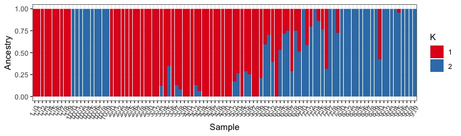
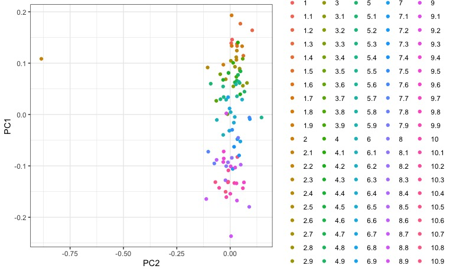

We're working with Rstudio on our desktops, so download the "vcf" and "analysis" directories to your laptop. The rest of this tutorial should be run in your Rstudio IDE.

NOTE: This tutorial is based on Rstudio 1.2.1335 and R 3.6.1, the latest version of both. Almost all steps should work identically on older versions, but there may be issues installing some packages. In this case, I recommend updating your version of R unless you have a specific reason not to.


The first step to any organized R project is to create a new Rstudio project. A project keeps all your different scripts and results together in a single directory. It also separates saved variables, so when you are switching between different projects you aren't accidentally using the same variables between them.

In Rstudio, select File->New Project

Then select "New Directory".


Click on "New Project".


Enter directory name "biol525d" and put it somewhere you can get to. In my case, I put it on the Desktop directory. Finally, click "Create Project".


After it has been created, move your "analysis" and "vcf" directory into your biol525d project directory so you have easy access to those files.


You're now in your Rstudio Project and the next step is to install the tidyverse package, which includes a suite of tools for manipulating data and plotting. The examples today will be focused on tidyverse solutions to problems. One key feature of the tidyverse world is the use of "%>%" to pipe data between commands. This functions similar to "\|" in the commandline and helps put together strings of commands that are work together and are easy to understand.


``` r
#install.packages("tidyverse")
library(tidyverse)
```

We calculated cluster assignment for each sample at different values of K. Lets try loading up a single output file. We'll also need to keep track of the sample names.

``` r
samplelist <- read.table("analysis/Chinook_GWAS_fiiltered_fixedsamps_LDpruned.fam", header=F)
class(samplelist) #its useful to keep checking how your data is being treated - here its a DF

#all of these columns except the first aren't useful to us - all we need is the order of sample names. 
samplelist <- samplelist[,1] #this is called *INDEXING*
class(samplelist) #after subset, its just a vector of "character" sample names, so its no longer a DF

#read in admixture results
read_delim("analysis/Chinook_GWAS_filtered_fixedsamps_numericChr_LDpruned.2.Q",
                  col_names = paste0("Q",seq(1:2)),
                  delim=" ")
```

For this last command, we're using the _read\_delim_ function which requires column names. Since the data file doesn't have any column names, we have to specify them and we're using a combination of paste and seq to produce "Q1", "Q2". We could have hard coded it c("Q1","Q2") but this way it works for an arbitrary number of columns just by changing the second value in seq().

Now we could work on each value of K individually, but its easier to load all of them at once. One problem is that they each have different numbers of columns. The solution is converting from a wide to long format. In a long format, each row has a single data point instead of multiple. The tidyverse tools are set up to prefer long data ((and there are other reasons)[https://sejdemyr.github.io/r-tutorials/basics/wide-and-long/#a-case-for-long-data]) so lets do that.

Its possible to load multiple files in a single call, but for transparency lets use a loop. We first make an empty dataframe that we're going to fill, then we loop through our output files, convert them to long format and add them to the master set.

```r
all_data <- tibble(sample=character(),
                   k=numeric(),
                   Q=character(),
                   value=numeric())

for (k in c(1:4,10)){
  data <- read_delim(paste0("analysis/Chinook_GWAS_filtered_fixedsamps_numericChr_LDpruned.",k,".Q"),
                  col_names = paste0("Q",seq(1:k)),
                  delim=" ")
  data$sample <- samplelist
  data$k <- k

  #Each time a new .Q file is read in, the following step converts it from wide to long format.
  data %>% gather(Q, value, -sample,-k) -> data
  all_data <- rbind(all_data,data) #append this iteration to the full dataset
}

all_data
# A tibble: 2,500 x 4
#   sample            k Q     value
#   <chr>         <dbl> <chr> <dbl>
# 1 Chinook.p1.i0     1 Q1        1
# 2 Chinook.p1.i1     1 Q1        1
# 3 Chinook.p1.i2     1 Q1        1
# 4 Chinook.p1.i3     1 Q1        1
# 5 Chinook.p1.i4     1 Q1        1
# 6 Chinook.p1.i5     1 Q1        1
# 7 Chinook.p1.i6     1 Q1        1
# 8 Chinook.p1.i7     1 Q1        1
# 9 Chinook.p1.i8     1 Q1        1
#10 Chinook.p1.i9     1 Q1        1
# … with 1,990 more rows

```

Now to plotting. We first try plotting just K=2 by filtering using the filter() command.
```r

all_data %>%
  filter(k == 2) %>%
  ggplot(.,aes(x=sample,y=value,fill=factor(Q))) +
  geom_bar(stat="identity",position="stack")
```


Hurray, it works! Although the base plot is pretty ugly. Lets fix a few things:
* *mutate(sample=gsub("Chinook.p","",sample))* <= remove the redunant "Chinook.p" from sample labels
* *xlab("Sample") + ylab("Ancestry")* <= Change the axis labels to be more accurate
* *theme_bw()* <= Remove the grey background.
* *theme(axis.text.x = element_text(angle = 60, hjust = 1))* <= Rotate the x-axis labels so they don't overlap
* *scale_fill_brewer(palette="Set1",labels=c("1","2"),name="K")* <= Change the fill color and legend labels

``` r
all_data %>%
  filter(k == 2) %>%
  mutate(sample=gsub("Chinook.p","",sample)) %>%
  ggplot(.,aes(x=sample,y=value,fill=factor(Q))) +
  geom_bar(stat="identity",position="stack") +
  xlab("Sample") + ylab("Ancestry") +
  theme_bw() +
  theme(axis.text.x = element_text(angle = 60, hjust = 1)) +
  scale_fill_brewer(palette="Set1",name="K",
                    labels=c("1","2"))

```


This is much better, but its still annoying that population 10, comes between population 1 and 2 (by default R won't sort vectors numerically if it has a character in it). We can get a little hacky with this and mutate the "sample" column one more time, removing the i character and telling R to explicitly treat sample as a factor (but first sorted numerically).
```

all_data %>%
  filter(k == 2) %>%
  mutate(sample=gsub("Chinook.p","",sample)) %>%
  mutate(sample=as.factor(as.numeric(gsub("i","",sample)))) %>%
  ggplot(.,aes(x=sample,y=value,fill=factor(Q))) +
  geom_bar(stat="identity",position="stack") +
  xlab("Sample") + ylab("Ancestry") +
  theme_bw() +
  theme(axis.text.x = element_text(angle = 60, hjust = 1)) +
  scale_fill_brewer(palette="Set1",name="K",
                    labels=c("1","2"))

```


We can also plot all the different K values together using facet_wrap().

``` r

all_data %>%
  mutate(sample=gsub("Chinook.p","",sample)) %>%
  mutate(sample=as.factor(as.numeric(gsub("i","",sample)))) %>%
  ggplot(.,aes(x=sample,y=value,fill=factor(Q))) +
  geom_bar(stat="identity",position="stack") +
  xlab("Sample") + ylab("Ancestry") +
  theme_bw() +
  theme(axis.text.x = element_text(angle = 60, hjust = 1),
        legend.position = "none") +
  scale_fill_brewer(palette="Spectral") +
  facet_wrap(~k,ncol=1)
  
```


That looks awesome. Make sure to take some time to look at how modeling an increasing number of ancestral populations leads to different inferences about population structure. 

Remember though, K=1 (no structure) was our most likely scenario! This actually isn't what we might have inferred from looking at the structure plot alone...at K=2 to 4, we can find individuals that fit in majority to all of the different modelled pops, in a way that might make sense geographically. Hmm. 

Lets take a look at the PCA and compare.


```r
pca_output<-read.table("analysis/Chinook_GWAS_filtered_fixedsamps_numericChr.eigenvec")
head(pca_output)
```

Plotting challenge 1
--------------------

Using some of the tricks we learned above, remove the redundant sample column, and then name the remaining columns (call the first "sample", the second "PC1", the third "PC2", all the way to the last column "PC20"! Save the output to "pca_named"

SOLUTION (check w a neighbour first!):

	pca_named<-pca_output[,-1]
	names(pca_named)<-c("sample",paste0("PC",seq(1:20)))
  {: .spoiler}
  
Now that you have your named column, plot your PCA!

```r
pca_named %>%
  mutate(sample=gsub("Chinook.p","",sample)) %>%
  mutate(sample=as.factor(as.numeric(gsub("i","",sample)))) %>%
  ggplot(aes(PC2,PC1, color=sample)) +
  geom_point() +
  theme_bw()

```


Woah. We can kinda begin to make up some clustering, but theres something funky going on with the legend. Its giving every individual a distinct color because we've said to color by sample (aes(color=sample)). We would like to color by population though, so lets split up those labels by the "." to get two columns, one for population and one for individual.

```r
pca_named %>%
  mutate(sample=gsub("Chinook.p","",sample)) %>%
  separate(col=sample,into=c("Pop","Ind")) %>%
  mutate(Pop=as.factor(as.numeric(Pop))) %>%
  ggplot(aes(PC2,PC1, color=Pop)) +
  geom_point() +
  theme_bw()

#what did we just do?  
?tidyr:::separate

```


Right away we can see that while there is _some_ clusering of individausl by population, that there is nearly as much clustering of populations with each other. We might not have expected this from looking only at the structure plot. Lets visualize some other PCs of genotype variation. 

Lets also make use of the actually eigenvalues.

```r
eigenvals<-read.table("analysis/Chinook_GWAS_fiiltered_fixedsamps.eigenval",col.names = "var")
#the eigenvals are the variance explained by each PC. We want to convert these to fraction of the total variance explained.

eigenvals$frac<-round( (eigenvals$var / sum(eigenvals$var)*100), digits=2) #percent of total variance

pc_1v2 <- pca_named %>%
  mutate(sample=gsub("Chinook.p","",sample)) %>%
  separate(col=sample,into=c("Pop","Ind")) %>%
  mutate(Pop=as.factor(as.numeric(Pop))) %>%
  ggplot(aes(PC2,PC1, color=Pop)) +
  geom_point() +
  ylab(paste0("PC1 (", eigenvals$frac[1], "%)")) +
  xlab(paste0("PC2 (", eigenvals$frac[2], "%)")) +
  theme_bw()

pc_1v3 <- pca_named %>%
  mutate(sample=gsub("Chinook.p","",sample)) %>%
  separate(col=sample,into=c("Pop","Ind")) %>%
  mutate(Pop=as.factor(as.numeric(Pop))) %>%
  ggplot(aes(PC3,PC1, color=Pop)) +
  geom_point() +
  ylab(paste0("PC1 (", eigenvals$frac[1], "%)")) +
  xlab(paste0("PC3 (", eigenvals$frac[3], "%)")) +
  theme_bw()
  

pc_2v3 <- pca_named %>%
  mutate(sample=gsub("Chinook.p","",sample)) %>%
  separate(col=sample,into=c("Pop","Ind")) %>%
  mutate(Pop=as.factor(as.numeric(Pop))) %>%
  ggplot(aes(PC2,PC3, color=Pop)) +
  geom_point() +
  ylab(paste0("PC3 (", eigenvals$frac[3], "%)")) +
  xlab(paste0("PC2 (", eigenvals$frac[2], "%)")) +
  theme_bw()


#plot them together
library(ggpubr)
ggarrange(pc_1v2, pc_1v3, pc_2v3, ncol=2,nrow=2, common.legend=T)

```


We also have the output from a PCA after LD thinning. Lets compare the PC1 v PC2 plot


```r
pca_pruned<-read.table("analysis/Chinook_GWAS_filtered_fixedsamps_numericChr_LDpruned.eigenvec")
pca_LDpruned_named<-pca_pruned[,-1]
names(pca_LDpruned_named)<-c("sample",paste0("PC",seq(1:20)))

eigenvals_pruned<-read.table("analysis/Chinook_GWAS_filtered_fixedsamps_numericChr_LDpruned.eigenval",col.names="var")
eigenvals_pruned$frac<-round((eigenvals_pruned$var / sum(eigenvals_pruned$var)*100), digits=2)


pc_1v2_pruned <- pca_LDpruned_named %>%
  mutate(sample=gsub("Chinook.p","",sample)) %>%
  separate(col=sample,into=c("Pop","Ind")) %>%
  mutate(Pop=as.factor(as.numeric(Pop))) %>%
  ggplot(aes(PC2,PC1, color=Pop)) +
  geom_point() +
  ylab(paste0("PC1 (", eigenvals_pruned$frac[1], "%)")) +
  xlab(paste0("PC2 (", eigenvals_pruned$frac[2], "%)")) +
  theme_bw() +
  ggtitle("LDpruned")

#plot the pruned and unpruned together
ggarrange(pc_1v2, pc_1v2_pruned,nrow=2, common.legend=T)

```


What does comparing these pruned and unpruned plots tell us?


Plotting challenge 2
--------------------

-   For a single PC1 vs PC2 plot, add individual sample labels to each point on the plot.

HINT:
  * Try the ggrepel package
  {: .spoiler}


