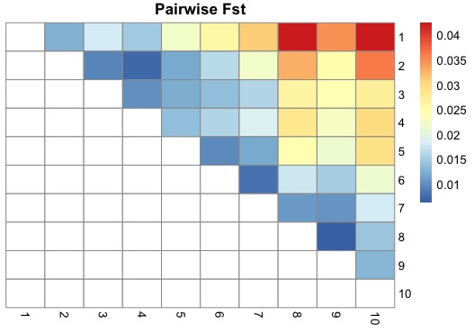
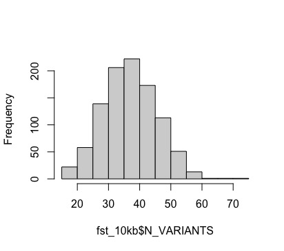
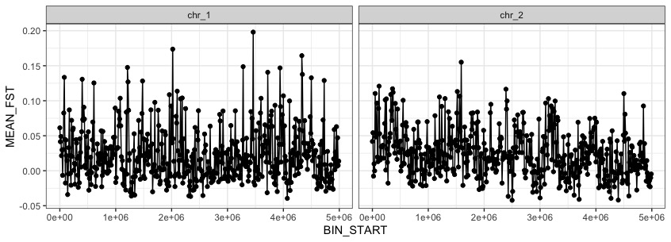
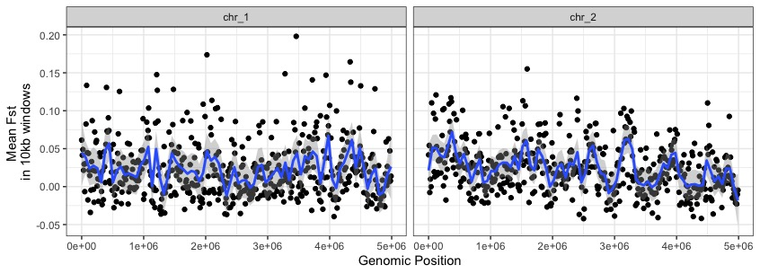
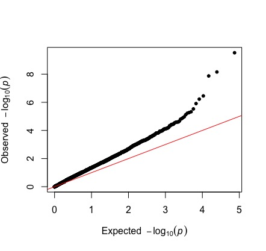
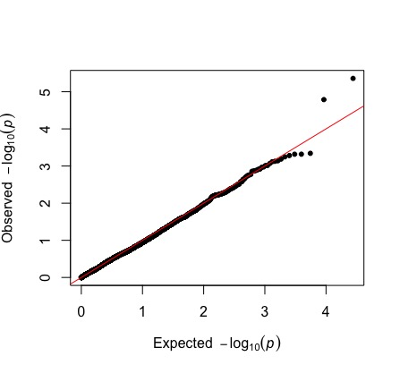
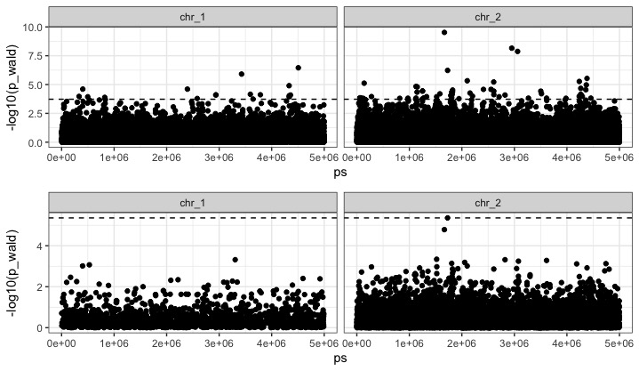

  
Just like before, we're going to need download the output files of the GWA and FST analyses from the server to our local computers.

Use scp again to copy over the updated `analysis` folder that contains the `fst_comparisons/` and the `gwas/` folders we'll be working with.


Lets start with *Fst*. 

We have two different outputs that we want to visualize: 
  1) fine scale fst in 10kb windows across the genome
  2) mean fst between all pairwise population comparisons (just a bit more insight into pop structure!)
  
  
Lets plot the latter first since we're still curious about whats going on after the structure and PCA plots.

```r
fst_pairwise<- read.table("analysis/fst_comparisons/weighted_fst_pairwise.txt")
head(fst_pairwise)
names(fst_pairwise)<-c("x","y","Fst")

#x     y      Fst
#1 pop1 pop10 0.042492
#2 pop1  pop2 0.012524
#3 pop1  pop3 0.018036
#4 pop1  pop4 0.014887
#5 pop1  pop5 0.022219
#6 pop1  pop6 0.025659
```
Since we have all pairwise comparisons, it would be nice to visualize the values in a matrix, but we'll have to fool around with the format of the data first
```r
#make population names just integers
fst_pairwise$x<-as.numeric(gsub("pop","",fst_pairwise$x))
fst_pairwise$y<-as.numeric(gsub("pop","",fst_pairwise$y))

#resort on both columns
fst_pairwise_ordered<-fst_pairwise[with(fst_pairwise, order(x, y)), ]
#if you're not sure why the "with" fxn was important, check out what it does below
with(fst_pairwise, order(x, y))

head(fst_pairwise_ordered)
tail(fst_pairwise_ordered)
#for the matrix, it would be nice if there was a 1,1 and a 10,10 comparison, to square things off. lets add them.
fst_pairwise_ordered <- rbind(c(1,1,NA), fst_pairwise_ordered)
fst_pairwise_ordered <- rbind(fst_pairwise_ordered, c(10,10,NA) )
```

Our data is in long format now - converting to wide format when we have all pairwise comparisons will lead to a matrix. Perfect.


```r
#OK, back to tidyverse to convert to a matrix
?tidyr:::pivot_wider
fst_wide<-pivot_wider(fst_pairwise_ordered, names_from=y, values_from=Fst)
fst_wide

## A tibble: 10 x 11
#x   `1`     `2`      `3`      `4`     `5`      `6`      `7`     `8`      `9`    `10`
#<dbl> <dbl>   <dbl>    <dbl>    <dbl>   <dbl>    <dbl>    <dbl>   <dbl>    <dbl>   <dbl>
#  1     1    NA  0.0125  0.0180   0.0149   0.0222  0.0257   0.0310   0.0423  0.0346   0.0425
#2     2    NA NA       0.00921  0.00721  0.0117  0.0163   0.0225   0.0327  0.0251   0.0360
#3     3    NA NA      NA        0.0102   0.0123  0.0137   0.0159   0.0262  0.0241   0.0271
#4     4    NA NA      NA       NA        0.0135  0.0157   0.0187   0.0282  0.0231   0.0299
#5     5    NA NA      NA       NA       NA       0.00984  0.0121   0.0244  0.0216   0.0292
#6     6    NA NA      NA       NA       NA      NA        0.00795  0.0176  0.0153   0.0216
#7     7    NA NA      NA       NA       NA      NA       NA        0.0107  0.0103   0.0182
#8     8    NA NA      NA       NA       NA      NA       NA       NA       0.00626  0.0144
#9     9    NA NA      NA       NA       NA      NA       NA       NA      NA        0.0131
#10    10    NA NA      NA       NA       NA      NA       NA       NA      NA       NA     

#and finally, remove the row and column that isn't Fst values, and change class = matrix
fst_wide<-fst_wide[,-1]
```

That took a good amount of work to get the pairwise Fst comparisons into matrix format. Now plotting is pretty simple...

```r
install.packages("pheatmap")
library(pheatmap)
pheatmap(fst_wide,cluster_rows=F, cluster_cols=F, na_col="white",main = "Pairwise Fst")
```



This plot shows really clear isolation by distance. Much more than the PCA or admixcture analysis. 
Populations sampled far apart (e.g. 1 and 10) show the most differentiation, and populations sampled closer together being more similar, and the progression is gradual.
Super cool.

Now we can dig into the finescale patterns of Fst across the genome. Since Pop 1 and 10 are found at the two extremes of the temperature gradient, lets focus on them.
  

```r
fst_10kb<-read.table("analysis/fst_comparisons/pop1_pop10_10kb.windowed.weir.fst",header=T)
head(fst_10kb)

#CHROM BIN_START BIN_END N_VARIANTS WEIGHTED_FST    MEAN_FST
#1 chr_1         1   10000         35    0.0994970  0.06130720
#2 chr_1     10001   20000         29    0.0693105  0.04144450
#3 chr_1     20001   30000         39    0.1192490  0.04892740
#4 chr_1     30001   40000         16    0.0556863  0.02148930
#5 chr_1     40001   50000         36    0.0486619  0.02972630
#6 chr_1     50001   60000         26   -0.0136650 -0.00660728
```

We can see that VCFtools kept track of how many SNPs were used to calculate Fst in each window. Lets check this distribution out.

```r
hist(fst_10kb$N_VARIANTS, main="")
summary(fst_10kb$N_VARIANTS) 

#Min. 1st Qu.  Median    Mean 3rd Qu.    Max. 
#15.00   31.00   37.00   37.36   43.00   72.00 

#looks good. nothing below 15 which isn't unreasonable diveristy (15/10000 = 0.0015)
```



We won't do any window filtering here, but variable data quality across windows is something to watch out for. Let's go ahead and plot fst across the genome

```r
ggplot(data=fst_10kb, aes(BIN_START, MEAN_FST)) +
  geom_point() +
  geom_path() +
  theme_bw() +
  facet_wrap(~CHROM) #like different K for the structure plots,but now we want fst by chromosome
```


This looks a bit too spikey, lets try fitting a non-paramatric loess regression line instead. Lets also fix the axis names.
```r
ggplot(data=fst_10kb, aes(BIN_START, MEAN_FST)) +
  geom_point() +
  geom_smooth(method="loess",span=.05) +
  theme_bw() +
  facet_wrap(~CHROM) +
  labs(x="Genomic Position",y="Mean Fst \nin 10kb windows")

```



While there are some windows with big Fst values (e.g. on chr1 near 3e06), we're not seeing any super obvious regions popping out from a basic fst scan. 

We can also look for alleles that underly differences between populations in a distinct, but conceptually related way. Instead of focusing on how differentiated alleles are between populations of interest, we can ask how phenotypic differences among populations might be relate to particular loci via genome-wide association.

GWA explictly tests whether phenotypic variation across individuals is well explained by genotypic variation, at every locus.

###*GWAS*

```r
gwas<-read.table("analysis/gwas/Chinook_GWAS.assoc.txt",header=T)
head(gwas)

#    chr         rs   ps n_mis n_obs allele1 allele0    af       beta        se    p_wald     p_fdr
#1 chr_1 chr_1:1006 1006     8    92       A       T 0.011 -0.3573080 0.5302345 0.5019816 0.8086090
#2 chr_1 chr_1:1470 1470     5    95       G       A 0.016 -0.7430778 0.4713674 0.1181495 0.5570746
#3 chr_1 chr_1:2857 2857     9    91       G       A 0.011 -0.2818247 0.7553201 0.7098653 0.9062662
#4 chr_1 chr_1:2914 2914     9    91       G       A 0.088 -0.3615058 0.2385600 0.1328986 0.5727862
#5 chr_1 chr_1:3460 3460     9    91       C       A 0.011  0.7438422 0.5261554 0.1606097 0.6044356
#6 chr_1 chr_1:3857 3857     7    93       A       C 0.016 -0.6309864 0.4731316 0.1854139 0.6234073
```
Note the p_wald column. These are our p-values. GWA has big issues with multiple testing, and also confounding with population structure.
A qq-plot (quantile-quantile plot) allows us to investigate our p-value distribution, which is influenced by both of these things potentially inflating false positives.

```r
install.packages("qqman")
library(qqman)

qq(gwas$p_wald)
```



The observed p-values start deviating from expected values, even at smaller -log10 pvalues. **Based on what we talked about in class, how would you interpret this?**

Remember, we also ran a GWAS analysis where we explitly controlled for population structure by including the relatedness matrix as a mixed effect variable. We'll read this in now and compare our two qqplots.

```r
gwas_rltdns<-read.table("analysis/gwas/Chinook_GWAS_relatedness.assoc.txt",header=T)
qq(gwas_rltdns$p_wald)

```



Notice how much how much closer our observed values are to our expected values, especially on the left side of the plot. There is some hint of overcorrection, where are observed values are lower than expect, which might happen if population structure is confounded with our selective signal, or because we do not have power given our sample size.

We want to see where those couple strongly associated loci lie in the genome. Lets do this for both our uncorrected and corrected gwas. 

We will control for multiple testing using a false-discovery rate correction.

```r
gwas$p_fdr<-p.adjust(gwas$p_wald,method = "fdr")
fdr10_uncor<-max(gwas$p_wald[gwas$p_fdr < 0.1])

p_uncor <- ggplot(data=gwas, aes(ps,-log10(p_wald))) +
  geom_point() +
  geom_hline(yintercept=-log10(fdr10_uncor), lty="dashed") +
  facet_wrap(~chr) +
  theme_bw()

gwas_rltdns$p_fdr<-p.adjust(gwas_rltdns$p_wald,method = "fdr")
fdr10_cor<-max(gwas_rltdns$p_wald[gwas_rltdns$p_fdr < 0.1])

p_cor <- ggplot(data=gwas_rltdns, aes(ps,-log10(p_wald))) +
  geom_point() +
  geom_hline(yintercept=-log10(fdr10_cor), lty="dashed") +
  facet_wrap(~chr) +
  theme_bw()

library(ggpubr)
ggarrange(p_uncor, p_cor, nrow=2, align = "v")
```




We have a bunch of hits in the uncorrected GWA, but in the corrected GWA - just one - on chromsome 2 at 1728226.
_It turns out that this  SNP is actually neutral, but there is a cluster of tightly linked causal SNPs just upstream at chr_2:1753234-1754473!_

Plotting Challenge
-------------------
 - Plot the Fst and GWA plots together, vertically aligned using ggarrange.
 - Annotate the signficant SNP with its gene name. This a bit harder cause we're working with a facetted plot. Save the plot as an object than the modify it.
 i.e. p_cor + geom_..()


